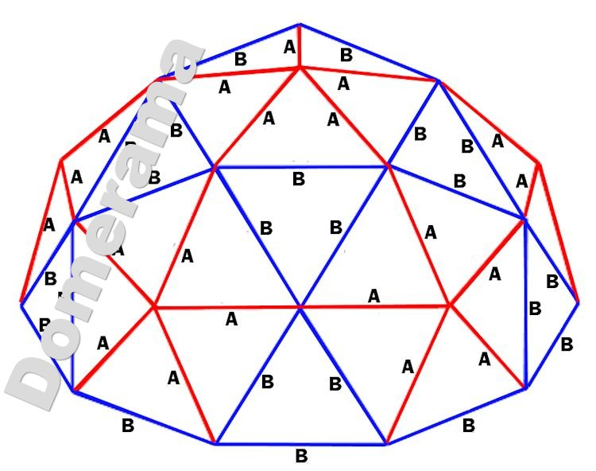
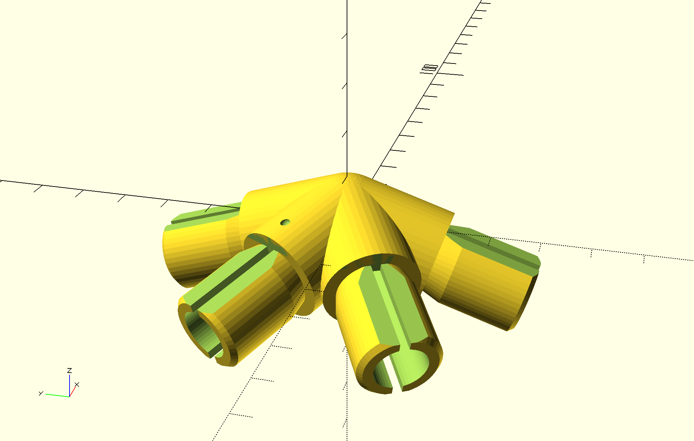
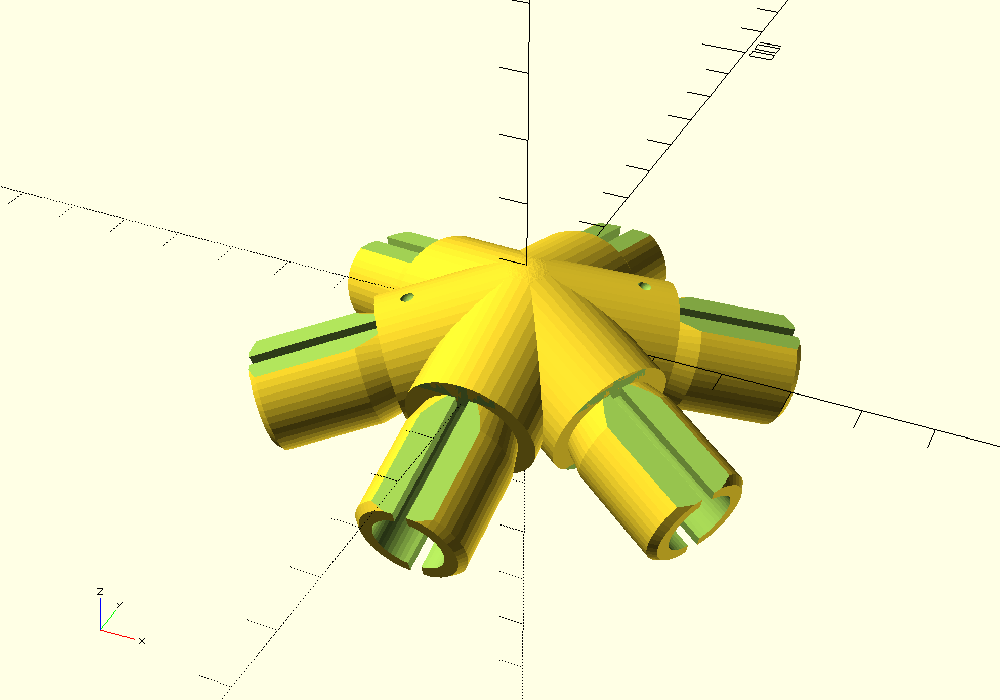

# domehome
A DIY dome garden house!

Dome shaped houses are nothing new, there's plenty of stuff about them out there. The idea with this project is that with the help of a 3D printer and cheap aluminium tubes you should be able to get something sturdy and easy-to-assemble without spending a fortune. For my prototype (3m high, 25 m2 floor area, frame only - no covering) I have to this point spent less than €300 for the aluminium tubes and and the filament for printing the connectors.

This particular design is for "2V 1/2 geodesic dome". For struts I'm using 20x1.5mm aluminium tubes, meaning that the inner diameter is 17mm. I have designed connectors with the proper fixed angles so if the tubes are of correct relative length, everything will fit snugly and the dome shape will come automagically. :) Use this [dome calculator](http://www.domerama.com/calculators/2v-geodesic-dome-calculator/) to find the correct length of the tubes. The connectors themselves add a total of 40mm to the "strut" lengths so remember that when using the calculator.

I've designed the strut connecting parts in OpenSCAD. This is basically my first endeavour into the 3D world so I'm sure the models are quite naïve in their construction. For some reason they take a looong time to render (like 10 minutes on my quad core rMPB). If you can optimise/simplify them, please let me know with a pull request.

_TODO: moar info, fancy images and what not_

_Coming soon: a flexible parts section for any geodesic dome_

## Tubes
You need 30 tubes of length "A" (see the [calculator](http://www.domerama.com/calculators/2v-geodesic-dome-calculator/) to find the correct length of the tubes. The connectors thems) and 35 tubes of length "B". The "A" variety is the shorter of them.

## Connecting parts
The connectors comes in four shapes, two for connecting four struts, one for five struts and one for six struts. The legs for "A" struts are marked with a little dot.

The connectors all use the leg.scad part as a base, so if you want to edit for other dimensions of tubes you just edit leg.scad and re-render the connectors.

### 4 strut connector
This part is used at the base of the dome and comes in two versions, "L" and "R", depending on which of the legs connects an "A" strut. You'll need 5 of each version.

### 5 strut connector
This part connects to 5 "A" struts. You'll need six of them.

### 6 strut connector
This part connects to 2 "A" and 4 "B" struts. You'll need 10 of them.

## Covering

_TODO_

## Assembly

_TODO_
